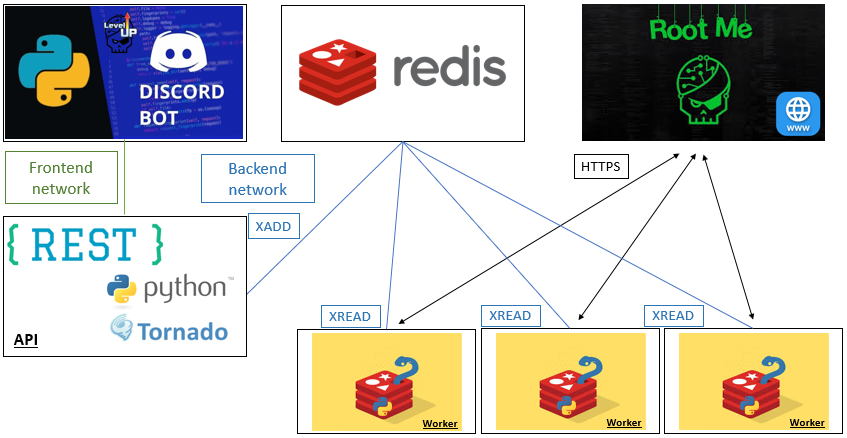
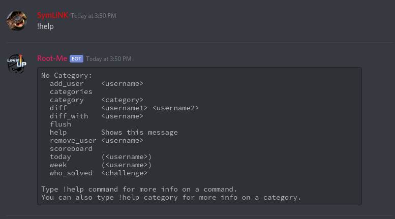
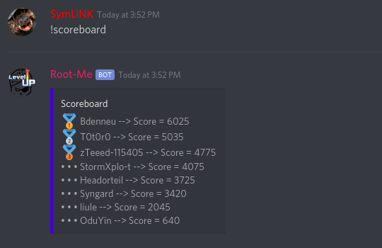

# Root-Me API 

URL: [https://root-me-api.hackademint.org](https://root-me-api.hackademint.org) \
BOT Discord: 
  - [link1](https://discordapp.com/api/oauth2/authorize?client_id=523372231561314304&permissions=0&scope=bot) (bot does not have admin rights)
  - [link2](https://discordapp.com/api/oauth2/authorize?client_id=523372231561314304&permissions=8&scope=bot) (bot has admin rights)
(see "[Discord Bot]" subsection to see how it works.)

## Description

[Root-Me](https://www.root-me.org/?lang=en) is a french platform that is the fast, easy, and affordable way to train your hacking skills. This website provides hundreds of challenges to train yourself in different and not simulated environments, offering you a way to learn a lot of hacking technics. \
It also provides dozens of virtual environments, accessible with a few clicks, to give you a realistic learning environment, without any limitation.

The purpose of this project is to provide an API to use 
[Root-Me](https://www.root-me.org/?lang=en) data, provide a discord bot fetching events and data from this API and to build a distributed system thanks to workers using [redis streams and consumer groups](https://redis.io/topics/streams-intro).

Using different worker instances is necessary to increase performance because
Root-Me website is blocking the requests if it detects too much connections
incoming from a specific public IP (You get an HTTP error code: "429 Too Many Requests"). \
(See advanced configuration).

## How does it works ? 

When a client is making a request on the API, the server is checking if there is existing data in an associated [redis key](https://redis.io/commands/getset). If not, the server is sending a task to workers through the appropriate [redis stream](https://redis.io/topics/streams-intro). If there is existing data, the API is checking if the last update is not too old (depends on `UPDATE_TIMEOUT` in [constants.py](https://github.com/zteeed/Root-Me-API/blob/master/api/api/constants.py)) and ask the workers for updates if necessary.

The form of the data is:

```
{
    'body': data,
    'last_update': timestamp_isoformat
}
```

The workers are permanently reading the streams, which are in the same [consumer group](https://redis.io/topics/streams-intro). You might read this script: [init.py](https://github.com/zteeed/Root-Me-API/blob/master/api/init.py).

When a worker receive a task, it makes HTTPS request to [Root-Me](https://www.root-me.org/?lang=en) website and parse the result into JSON format inside [redis keys](https://redis.io/commands/getset).



## Before install

You need to create a discord bot here: [https://discordapp.com/developers/applications/](https://discordapp.com/developers/applications/), get a token and replace it in `./bot_discord/bot/constants.py`.


## Simple configuration (1 worker)

### Install

```bash
 docker-compose up -d
```

## Advanced configuration (1+ workers)

- You can expose your redis by adding to redis service `docker-compose.yml`:
```
ports: 
    - 6379:6379
```
- If you want to deploy several workers you might need to modify [worker/main.py](https://github.com/zteeed/Root-Me-API/blob/master/worker/main.py), using the public ip where you deploy the redis container.

```python
app.redis = await aioredis.create_redis_pool(('PUBLIC_IP', 6379))
```

Then you can deploy a new worker separately using [worker/Dockerfile](https://github.com/zteeed/Root-Me-API/blob/master/worker/Dockerfile)

- If you have a physical interface which can be bind with different public IPv4 address:

1. Use the `docker-compose.yml` file from `advanced_configuration` folder

```bash
mv advanced_configuration/docker-compose.yml ./docker-compose.yml
```
You might need the attributes from the [docker macvlan network](https://docs.docker.com/network/macvlan/).


2. Details

This configuration avoids interfaces from backend network to get an access to internet, but we
want containers from this network to communicate together (api/redis/workers).

Every worker is bridged with a specific physical interface so that Root-Me detects those workers with different public IP. \ (We choose not to [rotate with proxies](https://www.scrapehero.com/how-to-rotate-proxies-and-ip-addresses-using-python-3/) for data privacy issues). 

*__Example__* (extract from [advanced_configuration/docker-compose.yml](https://github.com/zteeed/Root-Me-API/blob/master/advanced_configuration/docker-compose.yml)):
```
bridge_worker:
  driver: macvlan
  driver_opts:
    parent: eth1
    macvlan_mode: bridge
  ipam:
    config:
      - subnet: 157.159.191.0/24
        gateway: 157.159.191.2
        ip_range: 157.159.191.56/29
```

If you deploy 6 workers (see "Install" subsection), the workers will take
`157.159.191.56-61` as IPv4 address thanks to `ip_range` attribute (those are
taken in ascending order in the subnet specified).

> Communication with the Docker host over macvlan.
> When using macvlan, you cannot ping or communicate with the default namespace IP address. For example, if you create a container and try to ping the Docker host’s eth0, it will not work. That traffic is explicitly filtered by the kernel modules themselves to offer additional provider isolation and security.

[source](https://docs.docker.com/v17.09/engine/userguide/networking/get-started-macvlan/)


3. Additional information

- [docker networking in compose](https://docs.docker.com/compose/networking/)
- [docker macvlan networks](https://docs.docker.com/network/macvlan/)
- [remove docker networks](https://docs.docker.com/engine/reference/commandline/network_rm/)


### Install

For 6 workers:
```bash
docker-compose up -d --scale worker=6
```

Alternatively, you can use `docker-compose --compatibility up` with:

```
deploy:
  mode: replicated
  replicas: 6
```

It makes docker accept deploy section without using swarm.

### Result

```
docker ps

CONTAINER ID        IMAGE                 COMMAND                  CREATED             STATUS              PORTS                    NAMES
aa46c63b6d8f        root-me-api_worker    "/bin/sh -c 'python3…"   18 seconds ago      Up 5 seconds                                 root-me-api_worker_3
a68c6583cbc4        root-me-api_worker    "/bin/sh -c 'python3…"   18 seconds ago      Up 2 seconds                                 root-me-api_worker_5
2b35a79fe8bc        root-me-api_worker    "/bin/sh -c 'python3…"   18 seconds ago      Up 2 seconds                                 root-me-api_worker_1
3acc7e2fce96        root-me-api_worker    "/bin/sh -c 'python3…"   18 seconds ago      Up 7 seconds                                 root-me-api_worker_6
d63206e68591        root-me-api_worker    "/bin/sh -c 'python3…"   18 seconds ago      Up 7 seconds                                 root-me-api_worker_4
a14e3e6918b3        root-me-api_worker    "/bin/sh -c 'python3…"   18 seconds ago      Up 3 seconds                                 root-me-api_worker_2
0361d34552be        root-me-api_discord   "/bin/sh -c 'python3…"   25 seconds ago      Up 17 seconds                                root-me-api_discord_1
6eab3694fbce        root-me-api_api       "/bin/sh -c 'python3…"   25 seconds ago      Up 17 seconds       0.0.0.0:3000->3000/tcp   root-me-api_api_1
f21c0ef802aa        redis                 "docker-entrypoint.s…"   25 seconds ago      Up 17 seconds                                root-me-api_redis_1
```

## [API]

Some endpoints need a valid Root-Me username you can extract from the URL of your profile. \
Here is an example with https://www.root-me.org/zTeeed-115405 --> zTeeed-115405


- [https://root-me-api.hackademint.org/](https://root-me-api.hackademint.org/)
- [https://root-me-api.hackademint.org/v2](https://root-me-api.hackademint.org/v2)
- [https://root-me-api.hackademint.org/v2/challenges](https://root-me-api.hackademint.org/v2/challenges)
- [https://root-me-api.hackademint.org/v2/zTeeed-115405](https://root-me-api.hackademint.org/v2/zTeeed-115405)
- [https://root-me-api.hackademint.org/v2/zTeeed-115405/profile](https://root-me-api.hackademint.org/v2/zTeeed-115405/profile)
- [https://root-me-api.hackademint.org/v2/zTeeed-115405/contributions](https://root-me-api.hackademint.org/v2/zTeeed-115405/contributions)
- [https://root-me-api.hackademint.org/v2/zTeeed-115405/details](https://root-me-api.hackademint.org/v2/zTeeed-115405/details)
- [https://root-me-api.hackademint.org/v2/zTeeed-115405/ctf](https://root-me-api.hackademint.org/v2/zTeeed-115405/ctf)
- [https://root-me-api.hackademint.org/v2/zTeeed-115405/stats](https://root-me-api.hackademint.org/v2/zTeeed-115405/stats)

## [Discord Bot]

### Configuration

On your discord server you need to create a channel named `root-me-news` if you keep default configuration. You can change this channel name by updating the `bot_channel` value in [bot_discord/bot/constants.py](https://github.com/zteeed/Root-Me-API/blob/master/bot_discord/bot/constants.pyhttps://github.com/zteeed/Root-Me-API/blob/master/bot_discord/bot/constants.py).

### Features

### events

Display new challenges solved by users from team.


### help

Display available commands.



### add_user/remove_user \<username\>

Add a user to team / Remove a user from team.

Extract the username from the Root-Me profile link. \
Example with [https://www.root-me.org/zTeeed-115405?inc=info](https://www.root-me.org/zTeeed-115405?inc=info)


### scoreboard

Show team scoreboard.



### categories

Show list of categories.


### category

Show list of challenges from a category.


### today (\<username\>) 

Show challenges solved grouped by users for last day.


### week (\<username\>) 

Show challenges solved grouped by users for last week.


### who_solved \<challenge\>

Show who solved a specific challenge.


### diff \<username1\> \<username2\>
  
Show difference of solved challenges between two users.


### diff_with \<username\> 

Show difference of solved challenges between a user and all team.

### flush       

Flush all data from bot channel excepted events
